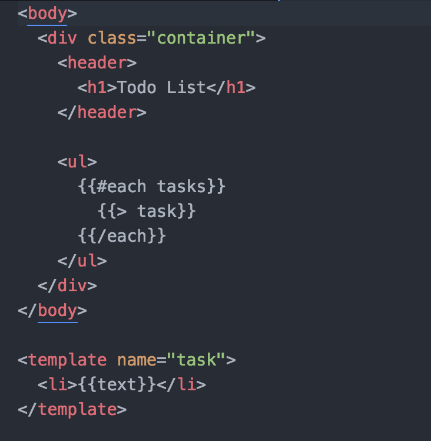
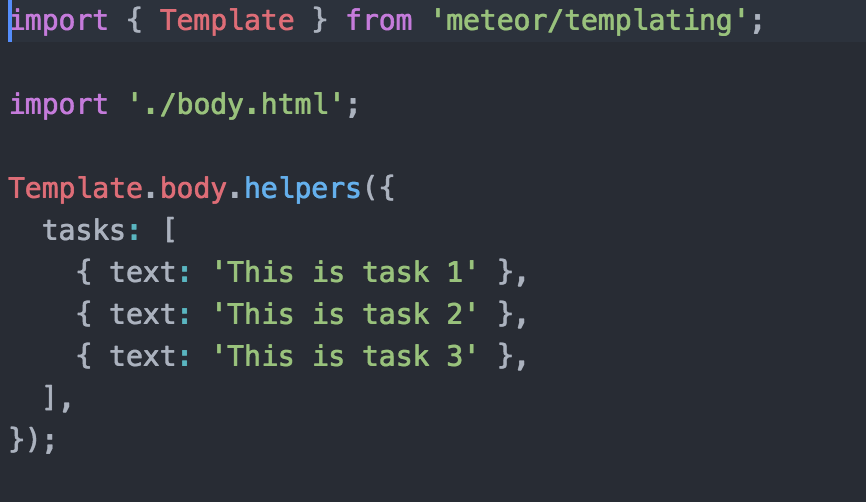

# meteor_simple-todos
Meteor example from https://www.meteor.com/tutorials/blaze/creating-an-app

---
The HTML entry-point is in [client/main.html](client/main.html)

---
Modified body looks like the following.

body.html

body.js

